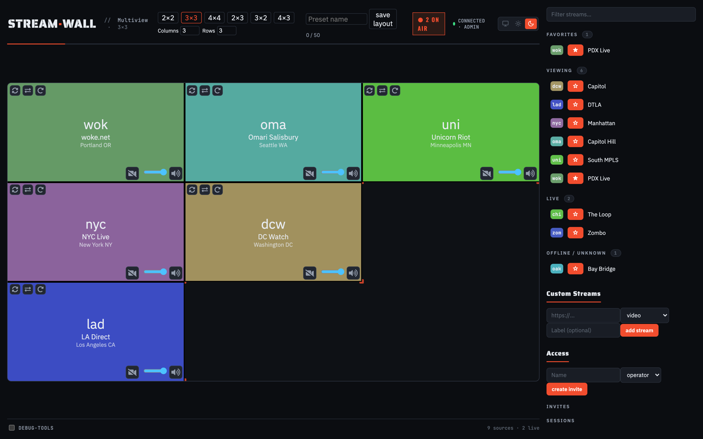

# Streamwall

[](https://github.com/NilsR0711/streamwall/releases/latest)
[](https://github.com/NilsR0711/streamwall/actions/workflows/ci.yml)
[](https://github.com/NilsR0711/streamwall/actions/workflows/codeql.yml)
[](LICENSE)


Streamwall makes it easy to compose multiple livestreams into a mosaic, with source attributions and audio control.

It's a cross-platform desktop app built with Electron and TypeScript. Streams are arranged in a grid you can rearrange on the fly, audio is switchable per tile, and the whole wall runs locally with an optional control server for remote operation.

## Download

Grab the latest build from the [**Releases**](https://github.com/NilsR0711/streamwall/releases/latest) page:

| OS          | Artifact                           | Architecture             |
| ----------- | ---------------------------------- | ------------------------ |
| **Windows** | Installer (`.exe`, Squirrel)       | x64                      |
| **macOS**   | `.zip` containing `Streamwall.app` | Apple Silicon (arm64)    |
| **Linux**   | `.deb` and `.rpm`                  | x64 (Debian/Ubuntu, RPM) |

> [!NOTE]
> Current builds are **unsigned pre-releases**, so the OS will warn before running them:
>
> - **macOS** quarantines the unsigned app. After unzipping, run `xattr -cr /Applications/Streamwall.app`, or right-click the app and choose **Open** — see [Building & releasing the desktop app](#building--releasing-the-desktop-app).
> - **Windows** SmartScreen shows an "unknown publisher" prompt: click **More info → Run anyway**.
>
> Signed builds are opt-in and produced automatically once the signing secrets are provisioned (see the same section).

Prefer to run from source instead of installing? See [Configuration](#configuration) and the `start:app` script below.

## How it works

Under the hood, think of Streamwall as a specialized web browser for mosaicing video streams. It uses [Electron](https://www.electronjs.org) to create a grid of web browser views, loading the specified webpages into them. Once the page loads, Streamwall finds the `<video>` tag and reformats the page so that the video fills the space. This works for a wide variety of web pages without specialized scrapers.


## Features

- **Resizable grid** — arrange streams in an NxN grid; resize it at runtime from the control UI (column/row presets or exact counts), no restart required.
- **Drag-to-place layout** — drag a tile onto another to swap their positions, or drop a stream from the list straight onto a grid cell.
- **Per-tile audio** — listen to any single tile's audio at a time, switchable with a click or hotkey, with a per-tile volume slider.
- **Blur/censor** — blur individual tiles, or trigger a wall-wide [Streamdelay](https://github.com/chromakode/streamdelay) censor mode.
- **Dark mode** — light, dark, or system-matched theme in the control UI.
- **Remote control with roles** — an optional web-based control server lets operators run the wall from a browser, with **admin**, **operator**, and **monitor** roles gated by invite links.
- **Automatic recovery** — failed or stalled stream loads are retried automatically with exponential backoff, with the failure surfaced on the wall and in the control UI.
- **Flexible data sources** — load streams from JSON APIs, TOML files, or add them ad hoc (including `overlay`/`background` kinds for widgets and chroma-key layers).
- **Playlists** — optionally cycle a grid cell through a fixed list of stream URLs on an interval.
- **Twitch chat bot** — an optional bot posts templated announcements and runs viewer polls in a Twitch channel's chat.



## Configuration

Streamwall has a growing number of configuration options. To get a summary run:

```
npm run start:app -- --help
```

For long-term installations, it's recommended to put your options into a
configuration file. Development runs use the root `start:app` script:

```
npm run start:app -- --config="../streamwall.toml"
```

Packaged app builds also auto-load `config.toml` from Electron's user data
directory before applying any `--config` file or CLI flags:

| OS      | Default user data config path                          |
| ------- | ------------------------------------------------------ |
| macOS   | `~/Library/Application Support/Streamwall/config.toml` |
| Windows | `%APPDATA%\\Streamwall\\config.toml`                   |
| Linux   | `~/.config/Streamwall/config.toml`                     |

Configuration precedence is:

1. user data `config.toml`
2. `--config` file
3. CLI flags

See `example.config.toml` for an example.

On first launch, if no user data `config.toml` exists yet, the control
window shows a dismissible hint with the exact path above, offering a
**Create Example Config** action that writes `example.config.toml` there as
a working starting point (restart Streamwall afterward to load it). The
same action is available as **File → Create Example Config** in the app
menu, alongside **File → Open Config Folder**, until a config file exists.

### Logging

Streamwall writes logs to both the console and a file in Electron's userData
log directory (its exact path is printed to the console on startup). File
and console verbosity default to `debug`; set `log.level` in your config
file (see `example.config.toml`) or pass `--log.level=<level>` on the
command line to change it. Valid levels, from quietest to loudest: `error`,
`warn`, `info`, `verbose`, `debug`, `silly`.

### Telemetry

Streamwall reports uncaught errors to a Sentry project run by the maintainers
(`telemetry.sentry`, default `true`). This covers the main process and every
renderer the app fully authors (the control window, and the background and
overlay layers); it deliberately does **not** cover the per-stream views or
the "browse" window, since those load arbitrary third-party URLs and
attaching error reporting there would leak that content's context to Sentry.
To opt out, set `sentry = false` under `[telemetry]` in your config file (see
`example.config.toml`) or pass `--telemetry.sentry=false` on the command
line.

## Remote control server

For multi-operator setups, `streamwall-control-server` lets you control the
wall from a web browser instead of (or in addition to) the local "control"
webpage. Build the web client and start the server with:

```
npm run start:server
```

On first run it prints two links to the console:

```
🔌 Streamwall uplink (shown once — save it now): ws://localhost:3000/streamwall/<id>/ws?token=<secret>
🔑 Admin invite: http://localhost:3000/invite/<id>#token=<secret>
```

- **Uplink endpoint** connects this app to the server. Pass it via
  `--control.endpoint` on the command line, or set `endpoint` under
  `[control]` in your config file (see `example.config.toml`). The endpoint
  must use `wss://` (or `ws://` to a loopback host) — Streamwall refuses to
  connect over an insecure remote endpoint.
- **Admin invite** opens the web control client and signs you in as an admin.
  From there, admins can create invite links for the other roles.

Three roles are available: **admin** (full control, including managing
invites), **operator** (control the grid and streams), and **monitor**
(blur/censor only, read-only otherwise).

See
[`packages/streamwall-control-server/README.md`](packages/streamwall-control-server/README.md)
for environment variable configuration (hostname/port, storage location, rate
limits) and a production deployment walkthrough.

**Known limitation:** grid edits (swap, drag-move, resize) sync as
independent per-cell updates in the shared Yjs document. If two operators
swap or move overlapping tiles at nearly the same instant, the last-writer-wins
merge can duplicate one stream into both tiles while dropping the other,
instead of leaving a consistent swap. This is inherent to modeling the grid as
independent per-cell values rather than one atomically-swapped unit, and is
low-impact in practice since concurrent operators rarely target the same
cells simultaneously.

## Data sources

Streamwall can load stream data from both JSON APIs and TOML files. Data sources can be specified in a config file (see `example.config.toml` for an example) or the command line:

```
npm run start:app -- --data.json-url="https://your-site/api/streams.json" --data.toml-file="./streams.toml"
```

Each entry (a `[[streams]]` table in TOML, or an object in the JSON array) supports the following fields. See `example.streams.toml` for examples.

| Field           | Type                                                                 | Required | Description                                                                                      |
| --------------- | -------------------------------------------------------------------- | -------- | ------------------------------------------------------------------------------------------------ |
| `link`          | string                                                               | yes      | URL of the stream page. For `overlay` streams, this is the URL loaded in the overlay `<iframe>`. |
| `kind`          | `"video"` \| `"audio"` \| `"web"` \| `"background"` \| `"overlay"`   | no       | Defaults to `"video"`. See kind reference below.                                                 |
| `label`         | string                                                               | no       | Short title shown on the wall overlay.                                                           |
| `labelPosition` | `"top-left"` \| `"top-right"` \| `"bottom-right"` \| `"bottom-left"` | no       | Corner where the label is drawn. Defaults to `"top-left"`.                                       |
| `source`        | string                                                               | no       | Attribution shown on the wall when `label` is absent.                                            |
| `notes`         | string                                                               | no       | Free-text notes shown in the control UI (not on the wall overlay).                               |
| `status`        | string                                                               | no       | Free-text status shown in the control UI.                                                        |
| `city`          | string                                                               | no       | Shown under the stream label on the wall overlay.                                                |
| `state`         | string                                                               | no       | Shown alongside `city` on the wall overlay.                                                      |
| `orientation`   | `"V"` \| `"H"`                                                       | no       | Vertical or horizontal video orientation, used by the control UI.                                |
| `rotation`      | number (0–360)                                                       | no       | Degrees to rotate the loaded page, e.g. for phone streams held sideways.                         |
| `addedDate`     | string                                                               | no       | Free-text date, shown in the control UI.                                                         |

### `kind` reference

- `video` (default) — a normal livestream page; Streamwall finds the `<video>` tag and fills the tile with it.
- `audio` — like `video`, but the tile is treated as audio-only.
- `web` — an arbitrary webpage, shown as-is without searching for a `<video>` tag.
- `background` — a webpage loaded behind the grid instead of in a tile.
- `overlay` — a webpage loaded as a full-screen `<iframe>` layered over the whole wall (e.g. scoreboards, alerts). See [Security: overlay and background streams](#security-overlay-and-background-streams) below.

## Playlists

A grid cell can optionally cycle through a fixed list of stream URLs on an
interval, independent of manual placement or any data source. Add one
`[[playlist]]` table per cell you want to cycle (see `example.config.toml`):

```toml
[[playlist]]
view = 0
interval = 60
urls = ["https://example.com/stream-a", "https://example.com/stream-b"]
```

| Field      | Type     | Required | Description                                                             |
| ---------- | -------- | -------- | ----------------------------------------------------------------------- |
| `view`     | number   | yes      | The grid cell (0-indexed) to cycle. Must be within the configured grid. |
| `interval` | number   | yes      | Seconds between advances.                                               |
| `urls`     | string[] | yes      | Stream URLs to cycle through, in order, looping back to the start.      |

A cell without a matching `[[playlist]]` table behaves as usual — assign it
manually from the control UI. Each URL is matched against the streams
currently known from your data sources (`json-url`/`toml-file`/custom); if a
URL doesn't currently resolve to a known stream, that step is skipped with a
warning and the cell keeps its previous content until the next advance.

## Security: overlay and background streams

Streams added with the `overlay` or `background` kind are loaded as live web
pages layered over the whole wall, inside sandboxed `<iframe>`s. Anyone with
control access can point these tiles at an arbitrary URL, so treat their
contents as untrusted.

These frames run with `sandbox="allow-scripts"` only. Scripts are allowed so
widget-style overlays (scoreboards, alerts, players) still work, but the page
runs in an opaque origin: it cannot escape its sandbox, reach Streamwall's
internal APIs, or read the app's cookies and storage. Top-level navigation,
popups, forms and downloads stay blocked.

`allow-same-origin` is intentionally not granted — combined with `allow-scripts`
it would let a page remove its own sandbox attribute and defeat the protection.
As a result, overlay/background pages have no access to their own origin's
cookies or local storage; widgets that depend on same-origin persistence are not
supported by design.

## Hotkeys

The following hotkeys are available with a "control" webpage focused, whether
that's the Electron control UI or the standalone web control client:

- **alt+[1...9,0,q,w,e,r,t,y,u,i,o,p]**: Listen to the corresponding stream
  (grid positions 0-19, in that key order)
- **alt+ctrl+[1...9,0,q,w,e,r,t,y,u,i,o,p]**: Listen to the corresponding
  stream (grid positions 20-39, same key order, for grids larger than 20 cells)
- **alt+shift+[1...9,0,q,w,e,r,t,y,u,i,o,p]**: Toggle blur on the
  corresponding stream (grid positions 0-19, in that key order)
- **alt+ctrl+shift+[1...9,0,q,w,e,r,t,y,u,i,o,p]**: Toggle blur on the
  corresponding stream (grid positions 20-39, same key order, for grids larger
  than 20 cells)
- **alt+s**: Select the currently focused stream box to be swapped
- **alt+c**: Activate [Streamdelay](https://github.com/chromakode/streamdelay) censor mode
- **alt+shift+c**: Deactivate [Streamdelay](https://github.com/chromakode/streamdelay) censor mode

The overlay window has its own hotkey:

- **ctrl+shift+i**: Open devtools for the overlay

## Building & releasing the desktop app

`npm run package` / `npm run make` / `npm run publish` (in
`packages/streamwall`) build the Electron app with
[Electron Forge](https://www.electronforge.io/). By default these produce
**unsigned** binaries — fine for local development, but macOS and Windows
both warn or outright block unsigned apps for end users, and Electron's
auto-updater requires a signed app on macOS.

To produce signed, notarized builds, set these environment variables before
running `make`/`publish` (see `packages/streamwall/forge.signing.ts`):

| Variable                       | Purpose                                                           |
| ------------------------------ | ----------------------------------------------------------------- |
| `APPLE_TEAM_ID`                | Apple Developer Team ID                                           |
| `APPLE_API_KEY`                | Path to an App Store Connect API key (`.p8`) used by `notarytool` |
| `APPLE_API_KEY_ID`             | App Store Connect API Key ID                                      |
| `APPLE_API_ISSUER`             | App Store Connect API Issuer ID                                   |
| `WINDOWS_CERTIFICATE_FILE`     | Path to a Windows code-signing certificate (`.pfx`)               |
| `WINDOWS_CERTIFICATE_PASSWORD` | Password for the certificate above                                |

macOS signing additionally requires a Developer ID Application certificate to
already be present in the signing machine's keychain (e.g. imported via
[`apple-actions/import-codesign-certs`](https://github.com/Apple-Actions/import-codesign-certs-action)
in CI). The macOS and Windows variables are independent — set either, both,
or neither. Builds with none of these set are unsigned, exactly as before.

**Until a release is signed:** macOS quarantines downloaded, unsigned apps
and may refuse to open them ("Streamwall is damaged and can't be opened").
Users can work around this by removing the quarantine attribute after
downloading:

```sh
xattr -cr /Applications/Streamwall.app
```

or by right-clicking the app and choosing "Open" instead of double-clicking.

### CI releases

Pushing a `v*` tag (or running the workflow manually) triggers
`.github/workflows/release.yml`, which runs the quality gate (lint, typecheck,
test) and then builds and publishes a GitHub release for Linux, Windows, and
macOS via `electron-forge publish`. Signing in CI is opt-in, matching the
local `make`/`publish` behavior above: builds stay unsigned until these
repository secrets are set.

| Secret                         | Purpose                                                       |
| ------------------------------ | ------------------------------------------------------------- |
| `APPLE_CERTIFICATE_P12`        | Developer ID Application certificate (`.p12`), base64-encoded |
| `APPLE_CERTIFICATE_PASSWORD`   | Password for the certificate above                            |
| `APPLE_TEAM_ID`                | Apple Developer Team ID                                       |
| `APPLE_API_KEY_BASE64`         | App Store Connect API key (`.p8`), base64-encoded             |
| `APPLE_API_KEY_ID`             | App Store Connect API Key ID                                  |
| `APPLE_API_ISSUER`             | App Store Connect API Issuer ID                               |
| `WINDOWS_CERTIFICATE_BASE64`   | Windows code-signing certificate (`.pfx`), base64-encoded     |
| `WINDOWS_CERTIFICATE_PASSWORD` | Password for the certificate above                            |

The workflow imports the macOS certificate into the runner's keychain via
`apple-actions/import-codesign-certs`, decodes the base64 secrets into
temporary files for the Windows certificate and the Apple API key, and sets
the corresponding `APPLE_*`/`WINDOWS_*` environment variables (see
`packages/streamwall/forge.signing.ts`) before publishing. macOS and Windows
signing are independent — provision either, both, or neither.
